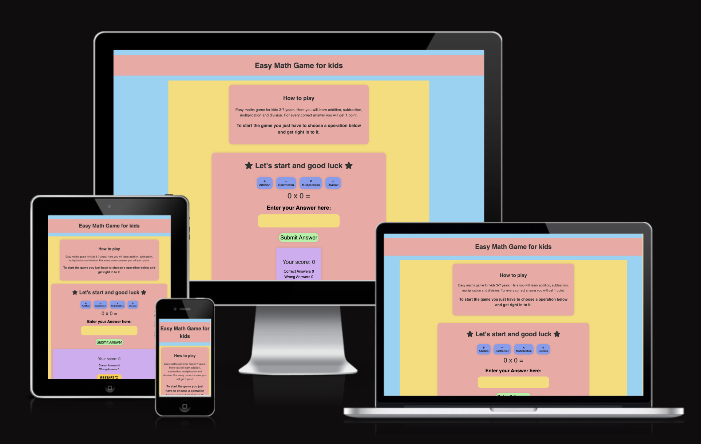
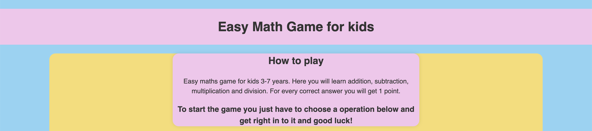
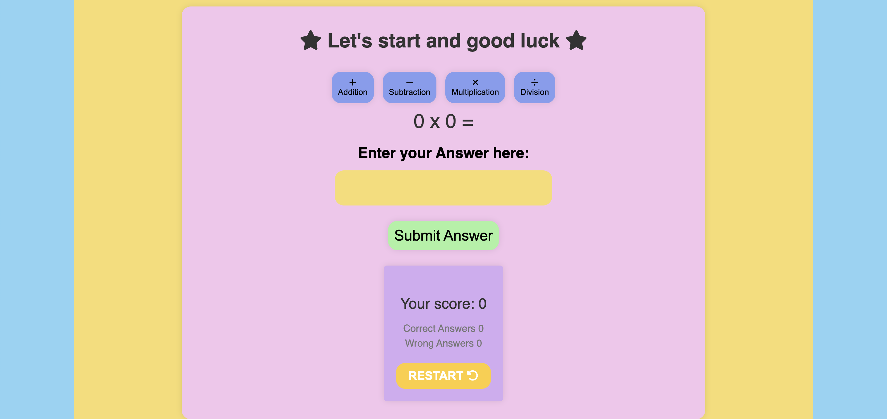

  

  <h3 align="center">Project 2 - Easy math game for kids</h3>

  

    My JavaScript project for Code Institute. A easy math game for kids. 
     
     
    <a href="https://camillacentio.github.io/math-game/">View Demo Website</a>
  

# Easy Math Game for kids

A simple math game for the little ones. A very simple structured game with light and bright colors to attract children to learn more. Here they will be able to learn addition, subtraction, multiplication and division.

## Features ✨
- **Colorful and  fun graphics:** Bright colors, interesting and simple design to capture children's attention
attention and make the game visually appealing.
- **User-friendly interface:** The game is easy to navigate, with clearly marked buttons with logos that make it easy for children to understand
- **Multiple game modes:** Children can choose between four different arithmetic methods to practice (addition, subtraction, multiplication or division).

## How to Play 🎮
1. When the game starts, children can select the type of math operation they want to practice (addition, subtraction, multiplication, or division).
2. Once they have chosen the operation, the game presents a number for them to solve
3. The children must then enter the correct number in the yellow box and press Submit. 
4. For each correct answer, the child receives points. 
5. If the child answers incorrectly, the game provides feedback and the correct answer so they can learn from their mistake.
6. As children progress through the game, the questions become progressively more challenging, helping them build their skills and confidence in math.

## Responsiveness 📱

The game is fully responsive and works well on different devices, such as phones and tablets and computer. The layout and font sizes adapt to various screen resolutions to provide a seamless experience for children. 

## Installation 💾

1. Clone the repository or download the source code.
2. Open the `index.html` file in your web browser.
3. Start playing and have fun!

## Technologies Used ⌨️

- HTML
- CSS
- JavaScript

## Bugs & Fixes 🪲

* Sometimes the questions are too difficult on division, probably a problem in the code. **(Bug not solved)**
* Score board is outside the container. **(Bug not solved)**
* No other bugs where found while testing the game.

## Testing 📝 

* The website has been tested in several different browsers such as Chrome, Safari and Firefox.
* I have tested that the page is responsive via Chrome devtools and on a Ipad.
* I have checked that the text is readable, that it is accessible to users.
* I have tested the form several times that it really works as intended and that all fields must be filled in.

## Features Left to Implement 🖥️

- Timed Challenges.
- Progressively harder levels.
- Language selector so more people can use the site

## Credit 💖

* Created with ❤️ by [Camilla Centio](https://github.com/camillacentio)

* Logo and Favicon is downloaded from [FreePik](https://www.freepik.com/free-vector/number-0-9-with-math-symbols_25676284.htm#query=child%20development%20numbers&position=1&from_view=search&track=ais)
* Icons from [Font Awesome](https://fontawesome.com/)
